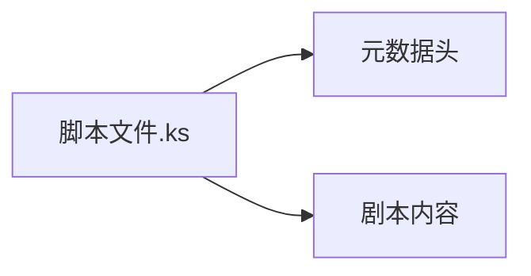

# Konado 脚本元数据规范  

::: tip 元数据是剧本的"身份证"  
它定义了章节的核心属性，确保Konado能正确解析并展示内容
:::


## 元数据的作用



元数据是剧本的**基础配置信息**，位于脚本文件开头，具有以下核心功能：
- **引擎识别**：提供章节的唯一标识
- **界面展示**：在游戏菜单中显示章节信息
- **资源管理**：支持多语言版本控制
- **制作追踪**：记录作者和修改信息

## 元数据字段详解

### 1. 章节标识 (chapter_id)
```text
chapter_id chapter01
```
| 属性 | 要求 |
|------|------|
| **位置** | 必须为文件首行 |
| **格式** | 英文+数字组合（推荐：`chapter`+数字） |
| **唯一性** | 全剧本中必须唯一 |
| **作用** | 引擎识别章节的核心标识 |

::: tip 最佳实践
使用`chapter01`、`chapter02a`等有规律的命名，避免使用空格和特殊字符
:::

### 2. 章节名称 (chapter_name)
```text
chapter_name 序章：命运的相遇
```
| 属性 | 要求 |
|------|------|
| **位置** | 文件第二行 |
| **格式** | 支持任意Unicode字符 |
| **长度** | 建议不超过30字符 |


### 3. 剧本语言 (chapter_lang)
```text
chapter_lang zh-cn
```
| 属性 | 要求 |
|------|------|
| **位置** | 文件第三行 |
| **格式** | 标准语言代码 |
| **常用值** | `zh-cn`(简体中文), `en`(英语) |
| **作用** | 支持多语言版本控制 |

### 4. 剧本作者 (chapter_author)
```text
chapter_author 张三
```
| 属性 | 要求 |
|------|------|
| **位置** | 文件第四行 |
| **格式** | 支持任意Unicode字符 |
| **作用** | 记录创作者信息 |

### 5. 剧本描述 (chapter_desc)
```text
chapter_desc 这是关于两个陌生人在雨夜相遇的故事...
```
| 属性 | 要求 |
|------|------|
| **位置** | 文件第五行 |
| **格式** | 支持任意Unicode字符 |


## 完整示例

```text
chapter_id chapter01
chapter_name 序章：雨夜相遇
chapter_lang zh-cn
chapter_author 小明
chapter_desc 暴雨中的电车车站...
```
